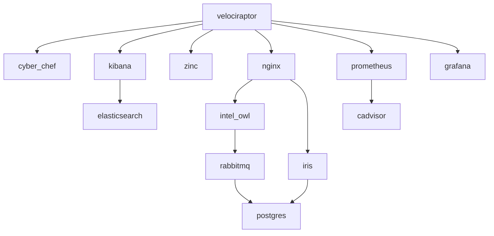

## Velocistack
### Requirements
* Operating System: Ubuntu 20.04 or Windows 11
* Container Software: Docker and Docker Compose

### Installation
**Step 1.** Download Velocistack.
```
git clone https://github.com/weslambert/velocistack &&\
cd velocistack
```

**Step 2.** Run the installer script.
```
`sudo ./install_velocistack`
```

**Troubleshooting**  
If you experience an error with `cadvisor` and `/var/lib/docker`, try replacing the volume with `/var/snap/docker/common/var-lib-docker/` (for Docker installs that have occurred via `snap`).

### Getting Started
Login to Velociraptor and/or other included apps using the information below.
| Working  | App          | Port | URL                                       |
| -------- | ------------ | ---- | ----------------------------------------- |
| &check;  | Velociraptor | 8889 | https://localhost:8889/                   |
|          | Cyberchef    | ---- | https://localhost/cyberchef               |
| &check;  | Nginx        | 443  |                                           |
| &check;  | Intel Owl    | 9001 | https://localhost/intelowl/               |
| &check;  | IRIS         | 9000 | https://localhost/iris/                   |
| &check;  | Kibana       | 5601 | https://localhost:5601/                   |
|          | Prometheus   | 9090 | https://localhost/velocistack/prometheus/ |
|          | Grafana      | 3000 | https://localhost:3000/                   |

### Authentication
Velocistack proxies authentication for all services except for Intel Owl and IRIS. 
| App          | Username      | Password   |
| ------------ | ------------- | ---------- |
| Velociraptor | admin         | admin      |
| IRIS         | administrator | admin      |
| Intel Owl    | See below.    | See below. |

### Container Relationships


### FAQs
**What is Velocistack?** 
Velocistack is a free and open solution for streamlined host-based forensics and investigation.
- Collect forensic artifacts
- Post-process collections
- Visualize collections or hunt results
- Create cases for investigation
- Enrich results with additional context

**Why was Velocistack created?**  
To allow individuals to quickly spin up a local, integrated environment for analysis and investigation of forensic artifacts collected by Velociraptor, using popular free and open tools.

**Who should use Velocistack?**
- Analysts
- Incident Responders
- Students
- Anyone!

### Screenshots
**Landing Page**  


**Cyber Chef**  


**Cyber Chef Support in Velociraptor**


**IntelOwl**  


**IRIS**  


**Kibana**


**Grafana**  
