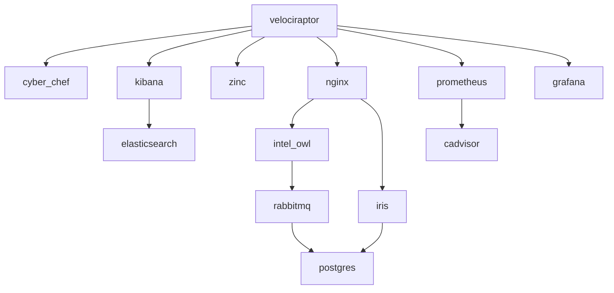
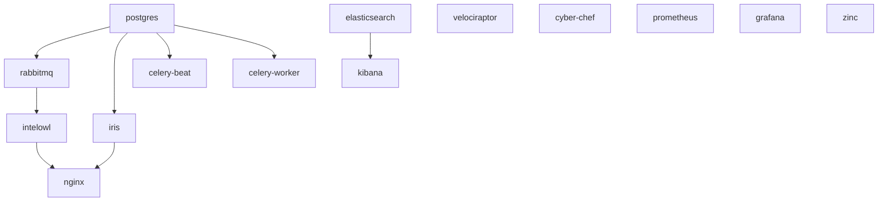
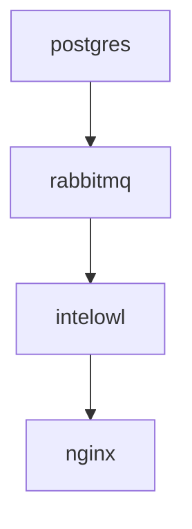
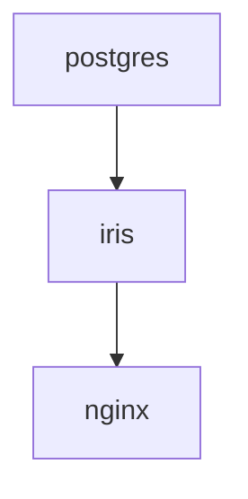
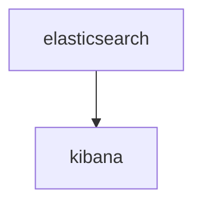
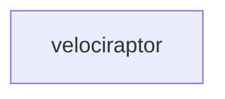
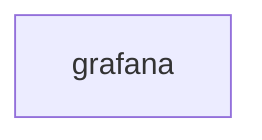

## Contents
* [Container Relationships](#container-relationships)
* [Profiles](#profiles)
  * [Velocistack](#velocistack)
  * [Intelowl](#intelowl)
  * [Iris](#iris)
  * [Elastic](#Elastic)
  * [Velociraptor](#velociraptor)
  * [Cyber Chef](#cyber-chef)
  * [Prometheus](#prometheus)
  * [Grafana](#grafana)
  * [Zinc](#zinc)

## Container Relationships

## Profiles
### Velocistack

### Intelowl

### Iris

### Elastic

### Velociraptor

### Cyber Chef

### Velociraptor

### Grafana

### zinc
